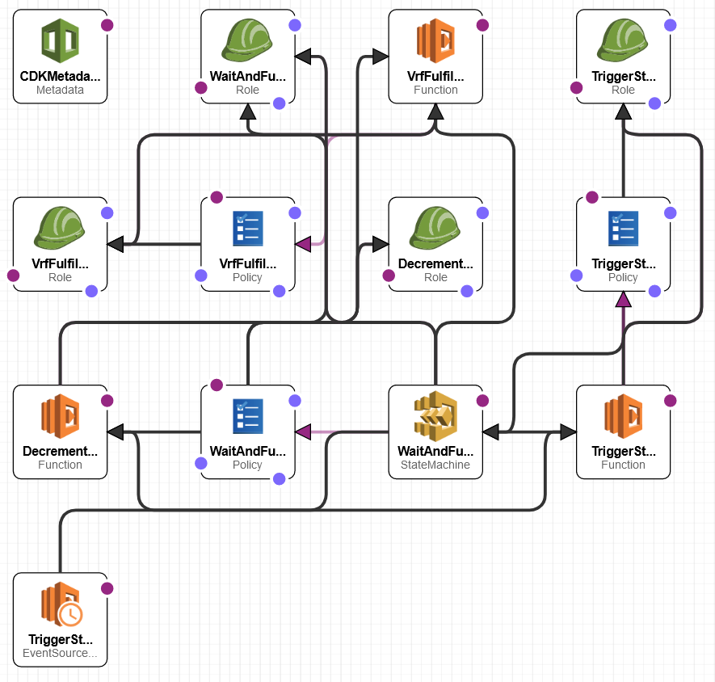

# Welcome to Serverless VRF Microservice
In blockchain, there is a need for a Verifiable Random Function (VRF) for smart contracts to access random values. Basically blockchain needs a RNG, and a smart contract can request a random value to be fulfilled at a certain time. This microservice emulates that behavior.


# Architecture
This repo actually deploys 2 microservices that work in conjunction: a VRF requester and a VRF fulfiller. In terms of CDK/Cloudformation terminology: there are 2 nested stacks sitting under a parent stack. The VRF requester requests random numbers and the VRF fulfill stack fulfills the random numbers.


Here's the architecture diagram for the VRF request stack: <p align="center"></p>
The requester emulates a smart contract requesting a random value, so every minute Eventbridge triggers Lambda to request a random number between a specified min and max values (and unique identifier), and publishes those values to an SQS queue with a random delay (to mimic random arrival of RNG requests). The SQS message also contains another random delay about when the VRF request should be fulfilled. The Lambda also records an entry into DynamoDB table.


Here's the architecture diagram for the VRF fulfill stack: <p align="center"></p>
The fulfiller stack is connected to the SQS queue. When a message on the queue is visible/available, it triggers a Lambda that triggers a Step Function. The Step Function's purpose is to determine when it is time to generate the random value. If not enough time has elapsed, then the Step Function waits 30 seconds; otherwise call the final Lambda that generates the random number between the min and max thresholds and writes it to DynamoDB table. Here is the picture of the Step Function that schedules the Lambda: <p align="center"></p>


## Miscellaenous Details
* The `Makefile` file is used to install the dependencies for each Lambda. It assumes that the Python version used to deploy this microservice is the same as the Lambda Python runtime version. If not, the dependencies installed may not work during Lambda invocation. The way to get around this is use `BundlingOptions` that uses a Docker container under the hood, which is shown in my Serverless Endpoints repo: https://github.com/eugeneh101/ServerlessEndpoints
* `cdk.json` is basically the config file, which specifies to deploy the microservice to us-west-1 (California) region. Also the wait time in the Step Function loop is configurable; I set it to 30 seconds.
* The following are the AWS resources deployed by CDK and thus Cloudformation for the requester stack: <p align="center"></p>
* The following are the AWS resources deployed by CDK and thus Cloudformation for the fulfiller stack: <p align="center"></p>
* The fulfillment Lambda that is the RNG actually has a 90% chance of failure. I did this to emulate real world conditions of systems not running perfectly. To build in fault-tolerance, the fulfillment Lambda can run up to 3 times. Each invocation increments the DynamoDB entry, so you can see how many times it failed before fulfilling the VRF request successfully.


# Deploying the Microservice Yourself
```
$ python -m venv .venv
$ source .venv/bin/activate
$ python -m pip install -r requirements.txt
$ cdk deploy  # assumes `make` is installed; assumes AWS CLI is configured + npm installed with `aws-cdk`: detailed instructions at https://cdkworkshop.com/15-prerequisites.html
```